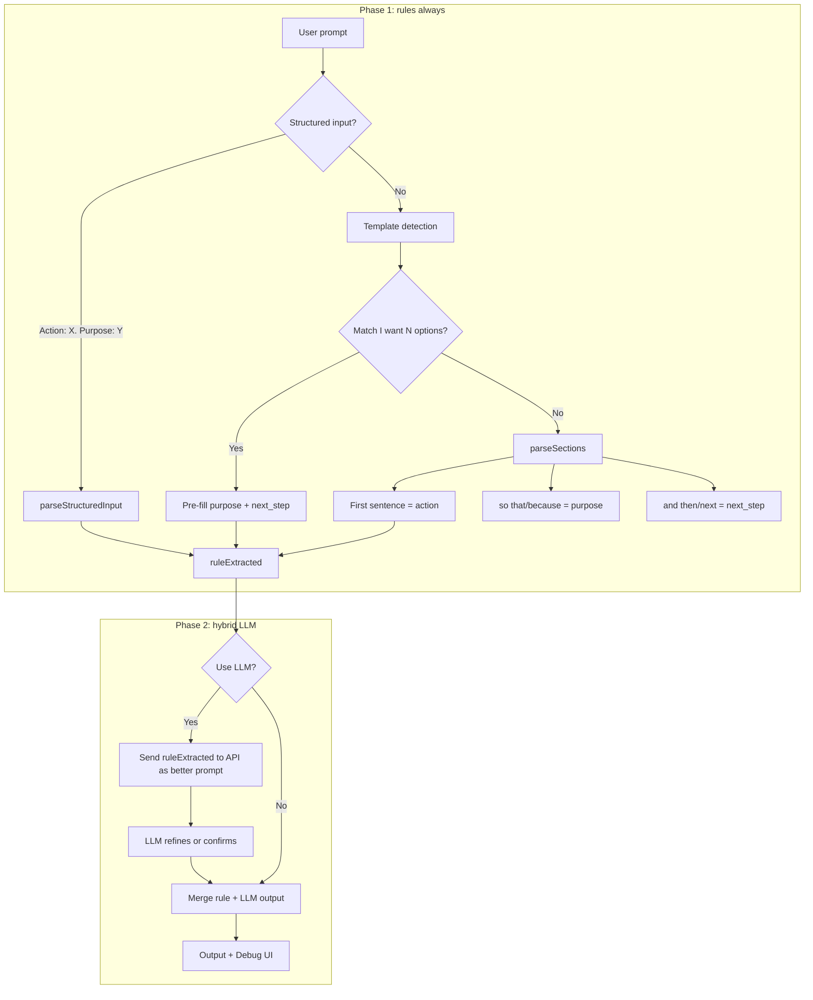

# Prompt-to-YAML Improvements

## What it's doing now

- **Frontend:** User pastes text → clicks Convert. If "Use LLM" is on, it POSTs `{ prompt }` to `/api/convert`.
- **API:** Calls OpenRouter (Llama 3.3 70B free) first; on failure/429, falls back to Groq.
- **API response:** Returns JSON: `agent_to`, `title`, `task_summary`, `purpose`, `next_step`, `context_files`, `deliverable_type`.
- **Frontend post-processing:** If values look generic (e.g. title "Task", purpose "Prepare for discussion", next_step "Review and respond"), it replaces them with rule-based heuristics (`deriveFromPrompt`).
- **Output:** Builds YAML frontmatter + body. Action line shows full prompt (truncation removed).

## Pre-LLM improvements

### Rule-based section extraction

Parse the prompt before the LLM:

- First sentence → action
- "so that", "because", "in order to" → purpose
- "and then", "first", "next", "then" → next steps

Use these as defaults and only call the LLM when rules are uncertain.

### Template detection

Match patterns like "I want [N] [things] [constraint]" and pre-fill:

- purpose: "User wants [N] [things] they can [constraint]"
- next_step: "Research and list [N] options with concrete first steps"

LLM then only fills in `agent_to`, `title`, `context_files`.

### Structured input parsing

If the user uses explicit structure (e.g. "Action: X. Purpose: Y. Next: Z"), parse it directly and skip the LLM for those fields.

### Hybrid: rules first, LLM second

Run rules to get purpose/next_step, then ask the LLM: "User said: [prompt]. We extracted purpose=X, next_step=Y. Confirm or improve." Use the LLM as a refiner instead of the main extractor.

### Clearer extraction prompt

Before calling the LLM, restructure the request: "Main action (one sentence): _. Purpose (why): _. Next step (concrete action for recipient): _." That makes the expected output format explicit.

### Two-phase extraction

Phase 1: rules for action, purpose, next_step. Phase 2: LLM only for agent_to, title, context_files, deliverable_type.

## Flow (hybrid approach)

## Overall objective

- **Goal:** Turn unstructured plain text into structured YAML handoffs for GostVault's multi-agent system.
- **Input:** Free-form user text (e.g. "I want 3 ways to make money online I can start today").
- **Output:** A handoff with:
  - **YAML frontmatter:** type, status, agent-from, agent-to, priority, deliverable, context_files
  - **Body:** Title, Action (what they want), Purpose (why), Next step (what the recipient should do)
- **Why:** So agents (marketer, builder, coordinator) receive clear, structured tasks instead of raw prose.
